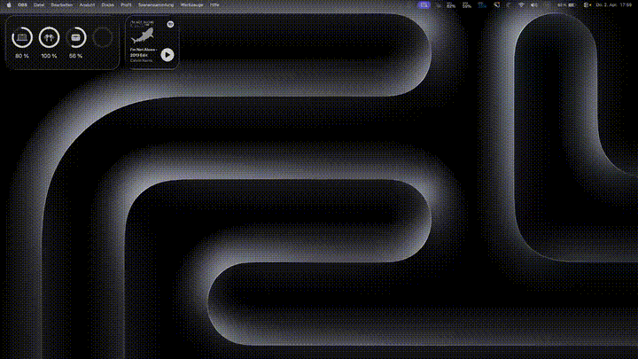

# DoubleClap

A lightweight macOS menu bar app that detects double claps and launches apps.

Uses adaptive audio analysis with crest factor detection to distinguish claps from speech, music, and desk thumps.



## Features

- Double clap detection via the microphone
- Configurable apps to launch on trigger
- Optional sound playback with volume control and custom duration
- Input/output audio device selection
- Adjustable sensitivity
- Menu bar icon with enable/disable toggle
- Runs silently in the background

## Install

### Build from source

Requires Xcode Command Line Tools.

```bash
./build.sh
```

### Run

```bash
open DoubleClap.app
```

To launch at login, add `DoubleClap.app` to **System Settings > General > Login Items**.

### Download

Pre-built binary is available in [Releases](../../releases). Download `DoubleClap.app.zip`, unzip, and move to `/Applications` or anywhere you like.

> **Note:** This app is **unsigned**. On first launch, macOS will block it. To open:
>
> 1. Right-click (or Control-click) `DoubleClap.app` and select **Open**
> 2. Click **Open** in the dialog
>
> Or remove the quarantine attribute:
> ```bash
> xattr -cr DoubleClap.app
> ```

## Settings

Click the 👏 icon in the menu bar and select **Settings...**:

| Setting | Description |
|---------|-------------|
| **Input Device** | Microphone to listen on (defaults to built-in) |
| **Apps to launch** | List of apps opened on double clap |
| **Sound** | Toggle + file picker for a confirmation sound |
| **Volume** | Playback volume (system volume is temporarily maxed during playback) |
| **Duration** | Limit sound playback length (seconds), leave empty for full |
| **Output Device** | Audio device for sound playback |
| **Sensitivity** | Detection threshold (High = more sensitive) |

## How it works

1. Continuously monitors microphone input via `AVAudioEngine`
2. Maintains a rolling ambient noise floor
3. Detects peaks that exceed ambient × spike factor and absolute minimum threshold
4. Validates clap shape using **crest factor** (peak/RMS ratio > 6) — claps are sharp transients, speech and thumps are not
5. Two validated claps within 0.6 seconds triggers the configured actions

## License

MIT
